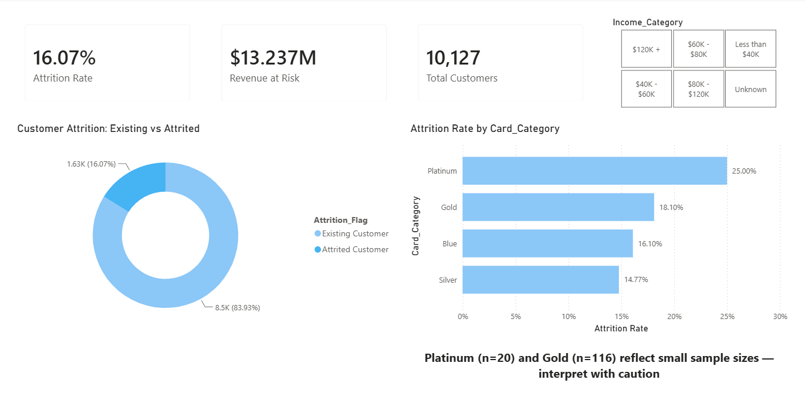
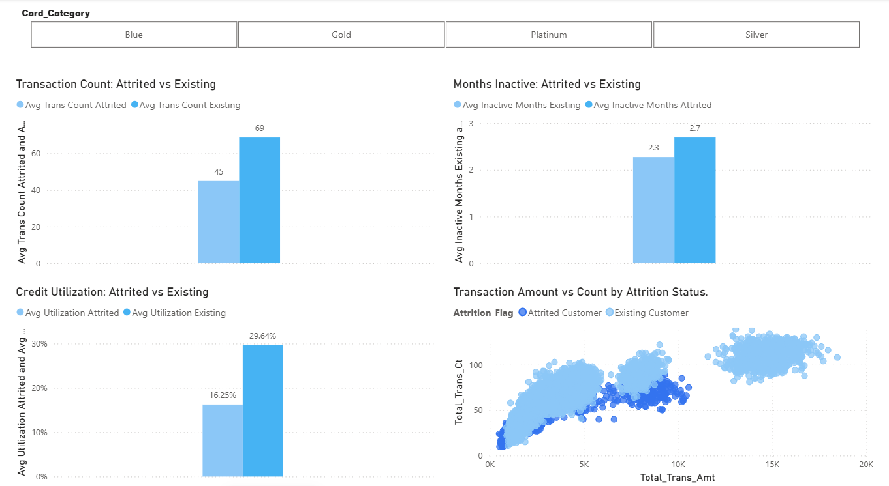

# Banking Credit Card Customer Churn Analysis

## Business Problem
A bank loses transaction fee income, interest income, and cross-sell 
opportunities every time a credit card customer churns — and by the time 
a customer formally closes their account, that revenue is already gone. 
This project identifies behavioral signals that appear *before* formal 
churn, giving a retention team a window to intervene.

## Why This Dataset
Unlike commonly used churn datasets built on demographics (age, salary, 
geography), BankChurners.csv captures actual behavior: transaction 
frequency, spend change quarter-over-quarter, months of inactivity, and 
credit utilization. Real bank risk and retention teams work from behavioral 
signals, not demographic profiles.

## Tools Used
- MySQL — data storage and analytical SQL (CTEs, window functions, CASE logic)
- Python (Pandas, Seaborn, Matplotlib) — data cleaning and exploratory analysis
- Power BI + DAX — interactive retention dashboard

## Dataset Source
Credit Card Customers — BankChurners.csv, Kaggle (Sakshi Goyal), 10,127 rows, 23 columns.

## Data Quality Issues Found and Fixed
1. **Data leakage** — two Naive_Bayes_Classifier columns (a prior model's 
   predictions) were dropped before any analysis to avoid circular results.
2. **Hidden missing values** — Education_Level (15.0%), Marital_Status (7.4%), 
   and Income_Category (10.98%) contained "Unknown" as a valid string — 
   invisible to `isnull().sum()`. Retained as an explicit category rather 
   than dropped, given the scale of data loss dropping would cause.
3. **Meaningless numeric ID** — CLIENTNUM is an arbitrary identifier with 
   no relationship to customer behavior; dropped to avoid spurious correlation noise.
4. **Credit limit ceiling** — Credit_Limit is capped at 
   a platform maximum (34,516) shared by 508 customers and floored at 1,438 
   shared by 507 customers, unrelated to account tenure (Months_on_book 
   averaged 36.0 for both groups) — evidence of synthetic capping in the dataset.

## Key Findings
- Overall attrition rate: **16.07%** (1,627 of 10,127 customers)
- Total_Trans_Ct is the strongest behavioral predictor of churn 
  (correlation: **-0.37**), far ahead of contact frequency (0.20) or 
  months inactive (0.15)
- Attrited customers average **44.9 transactions** vs **68.7** for existing customers
- Attrition rises sharply from **12.49% at 2 contacts to 20.15% at 3 contacts**, 
  reaching **49.13%** for customers with 5+ contacts (n=230)
- Credit utilization: **16.25%** (attrited) vs **29.64%** (existing) — 
  low utilization signals disengagement before churn
- Revenue at Risk: **$13.24M** in credit exposure already lost to churned customers
- Platinum cardholders show the highest attrition rate (25.00%) but on a 
  small sample (n=20) — interpret cautiously rather than as a definitive segment finding

## Dashboard Screenshots

## How to Run Locally
1. Clone this repo: `git clone https://github.com/Venkatavishnuvardhanthota/banking-churn-analysis`
2. Create a virtual environment: `python -m venv venv` then `venv\Scripts\activate`
3. Install dependencies: `pip install -r requirements.txt`
4. Download BankChurners.csv from Kaggle, place in `data/raw/`
5. Run notebooks in `notebooks/eda.ipynb`
6. Open `dashboard/banking_churn_analysis.pbix` in Power BI Desktop

## Contact
Thota Venkata Vishnu Vardhan  — venkatavishnuvardhanthota@gmail.com 
Last updated: July 2026 
